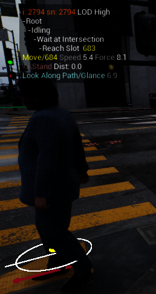

# GDExtensions plugin

Plugin to display a window above entities like in the Epic City Sample:



Works if the entity contains an FTransformFragment fragment, all other fragments are optional.

## Installation

In an existing project:

```
cd Plugins (if this directory does not exist create it)
git submodule add https://github.com/JohnJFarrow/GDMassExtensions GDMassExtensions
```